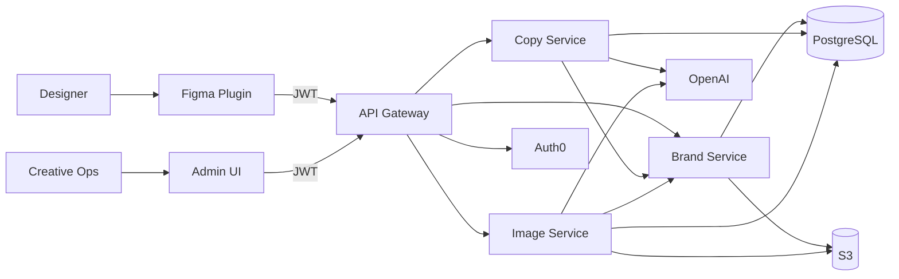

# Component Diagram

## System overview



**Four backend services:**

| Service | Owns | Why separate |
|---------|------|--------------|
| **Gateway** | Auth, routing | Single entry point for plugin + admin |
| **Brand Service** | CRUD brand identity, PDF ingest (F3) | Single source of truth for tone, visual, glossary — shared by Copy + Image |
| **Copy Service** | Copy variants, translation | Fast, sync — reads brand from Brand Service |
| **Image Service** | Async DALL-E jobs | Slow — reads visual guidelines from Brand Service; scale independently |

MVP: 1 instance each. Monorepo, 4 Docker images.

---

## Figma plugin ↔ services

| Plugin action | Calls |
|---------------|-------|
| Login | Auth0 → JWT to Gateway |
| Load brand picker | `GET /brands` → Brand Service |
| Generate copy | `POST /copy/generate` → Copy Service |
| Generate image | `POST /images/jobs` → Image Service |
| Poll image | `GET /images/jobs/{id}` → Image Service |
| Apply to canvas | Local only (Figma API) |

**Admin UI** (Creative Ops): all brand CRUD via Gateway → Brand Service. See [00-goals-figma-plugin.md](./00-goals-figma-plugin.md).

---

## Data ownership

| Service | Tables / files |
|---------|----------------|
| **Brand Service** | `brands`, `glossary` — writes only service for these |
| **Copy Service** | `usage_events` (copy) — reads brands via Brand Service API |
| **Image Service** | `jobs`, `usage_events` (images) — reads brands via Brand Service API |
| **S3** | Brand PDFs (Brand Service), generated PNGs (Image Service) |

All rows include `client_id`.

---

## Scaling ladder

| Stage | Users | What to add |
|-------|-------|-------------|
| **MVP** | ~10 | 4 services × 1 instance, single region |
| **Growth** | ~50–100 | LB → Gateway; scale **Image Service** |
| **Multi-client** | 100+ | `client_id` enforcement; Brand Service admin for per-client onboarding |
| **Global** | Worldwide | Deploy API + **regional S3 bucket** per geography (e.g. EU, US); route clients to home region |

Brand Service is low-traffic (CRUD + reads) — rarely needs more than 1 instance.

---

## Deployment (MVP)

```
GitHub Actions → 4 images → managed containers + Postgres + S3
```

Deploy in **<12h** (N5): CI → staging → prod tag rollback.
