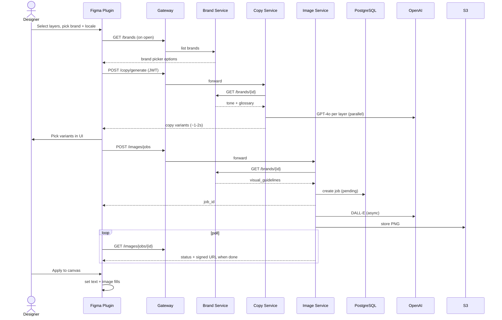

# Data Flow: "Localise Copy & Replace Images"

## Sequence



## Step-by-step flow

| # | Plugin | Backend |
|---|--------|---------|
| 1 | Read selected text layers + image fills | — |
| 2 | User picks brand, locale | — |
| 3 | `POST /copy/generate` | Copy Service → Brand Service for tone/glossary → GPT-4o |
| 4 | Show variant picker | — |
| 5 | User selects winners | — |
| 6 | `POST /images/jobs` with briefs + optional reference image | Image Service → Brand Service for visual rules → DALL-E |
| 7 | Poll + show thumbnails | Image Service → DALL-E → S3 |
| 8 | Apply text + fills to Figma nodes | — |

**Latency (N1):** Copy path sync (~2s). Image path async — never block copy on DALL-E.

## Example payloads

**Copy request:**
```json
{
  "client_id": "designtechco",
  "brand_id": "brand_x",
  "locale": "de-DE",
  "layers": [{ "id": "123:456", "text": "Run your world", "role": "headline" }]
}
```

**Copy response:**
```json
{
  "123:456": ["Erobere deine Welt", "Deine Welt. Dein Tempo."]
}
```

**Image job response:**
```json
{ "job_id": "job_abc", "status": "pending" }
```

**Poll (done):**
```json
{
  "status": "done",
  "images": { "123:789": "https://cdn.../job_abc.png" }
}
```
